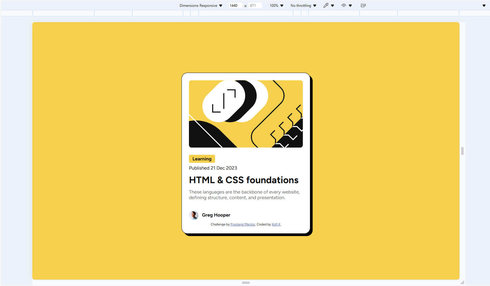
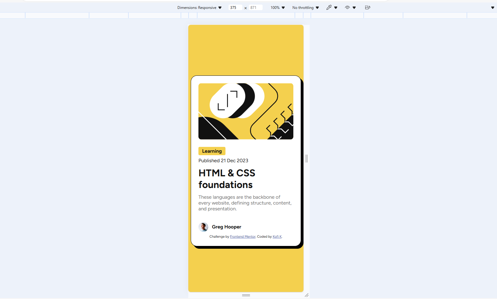
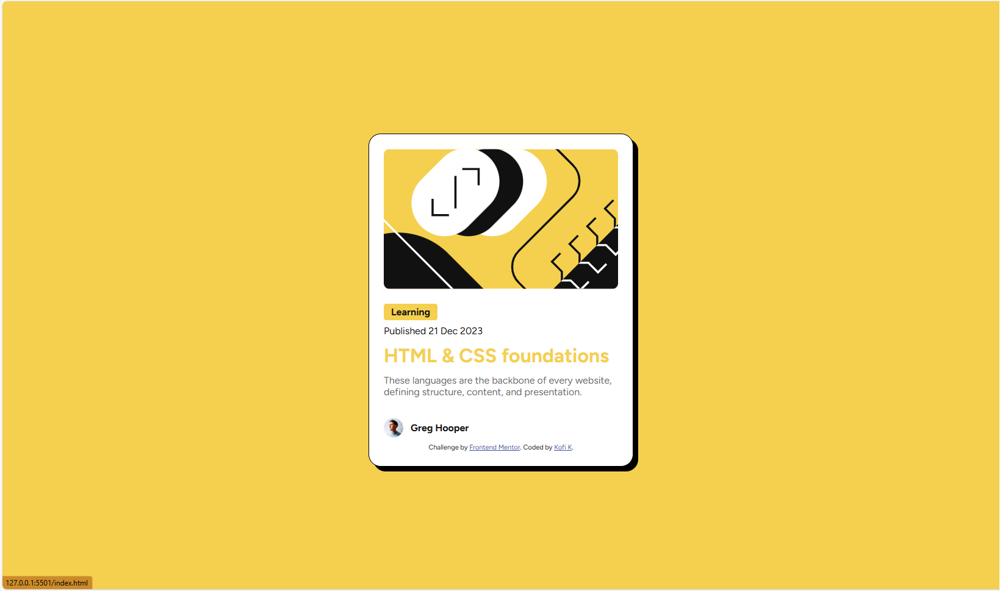

# Frontend Mentor - Blog preview card solution

This is a solution to the [Blog preview card challenge on Frontend Mentor](https://www.frontendmentor.io/challenges/blog-preview-card-ckPaj01IcS). Frontend Mentor challenges help you improve your coding skills by building realistic projects. 

## Table of contents

- [Overview](#overview)
  - [The challenge](#the-challenge)
  - [Screenshot](#screenshot)
  - [Links](#links)
- [My process](#my-process)
  - [Built with](#built-with)
  - [What I learned](#what-i-learned)
  - [Continued development](#continued-development)
  - [Useful resources](#useful-resources)
- [Author](#author)
- [Acknowledgments](#acknowledgments)

**Note: Delete this note and update the table of contents based on what sections you keep.**

## Overview

### The challenge

Users should be able to:

- See hover and focus states for all interactive elements on the page

### Screenshot



This is the desktop view.



This is the mobile view.



This is a view of the blog title when one hovers over it.


### Links

- Solution URL: [Add solution URL here](https://your-solution-url.com)
- Live Site URL: [Add live site URL here](https://your-live-site-url.com)

## My process

### Built with

- Semantic HTML5 markup
- CSS custom properties
- Flexbox
- CSS Grid


### What I learned

Use this section to recap over some of your major learnings while working through this project. Writing these out and providing code samples of areas you want to highlight is a great way to reinforce your own knowledge.

I revised on what I leant about BEM ,grid and flexbox in order to make this card. I also learnt on how to use Figma to design the website as close to the design as possible.

I'm especially proud of how I used BEM naming convection to write the code below.

```css
.card{
    width: max-content;
    max-width:24rem ;
}
.card--bgClrWhite{
    background-color: var(--White);
}
.card--border{
    border: thin solid black;
    
}
.card--borderRadius_20px{
    border-radius: 1.25rem;
}
.card--borderRadius_10px{
    border-radius: .625rem;
}
.card--padding24px{
    padding: 1.5rem;
}
.card--shadow{
    box-shadow: .5rem .5rem black;
}
.card--colorGray500{
    color: var(--Gray500);
}
.card__topImg{
    width: 100%;
}


```

### Continued development

I think I'm going to improve my knwoledge and use of BEM,Grid and Flexbox in order to create responsive webpages and
use Figma more often.

<!-- ### Useful resources

- [Example resource 1](https://www.example.com) - This helped me for XYZ reason. I really liked this pattern and will use it going forward.
- [Example resource 2](https://www.example.com) - This is an amazing article which helped me finally understand XYZ. I'd recommend it to anyone still learning this concept.

**Note: Delete this note and replace the list above with resources that helped you during the challenge. These could come in handy for anyone viewing your solution or for yourself when you look back on this project in the future.** -->

## Author

- Website - [Kofi K](https://github.com/Kofi100)
- Frontend Mentor - [@Kofi100](https://www.frontendmentor.io/profile/Kofi100)

<!-- ## Acknowledgments

This is where you can give a hat tip to anyone who helped you out on this project. Perhaps you worked in a team or got some inspiration from someone else's solution. This is the perfect place to give them some credit.

**Note: Delete this note and edit this section's content as necessary. If you completed this challenge by yourself, feel free to delete this section entirely.** -->
